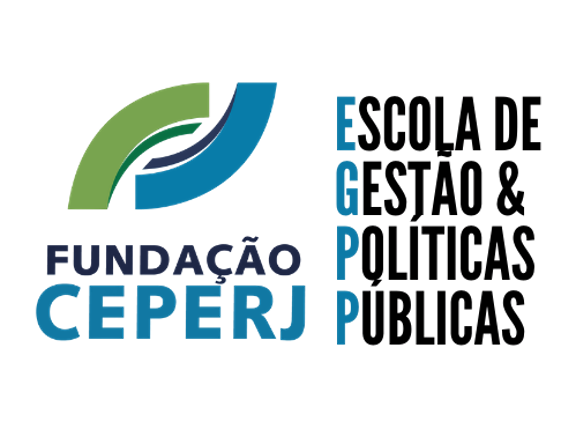

--- 
title: Análise de Dados em **R** - nível intermediário
author: "Bruno Lucian & Claudia Jakelline"
date: "`r Sys.Date()`"
site: bookdown::bookdown_site
output: 
  bookdown::gitbook:
    includes: 
      in_header: 'style.css'
    config:
      edit : null
      download: null
      search: yes
      sharing:
       facebook: yes
       github: yes
       twitter: yes
       linkedin: yes
       weibo: no
       instapaper: no
       vk: no
      fontsettings:
        theme: spacelab
  bookdown::pdf_book:
    keep_tex: yes
documentclass: book
# bibliography: [book.bib, packages.bib]
# biblio-style: apalike
# link-citations: no
github-repo: brunolucian/cursointermediarioR
description: "Livro texto que acompanha o Curso intermediário de Análise de Dados em R "
---


# Prefácio {-}

```{r, message=FALSE, warning=FALSE, comment=FALSE, echo=FALSE}
library(tidyverse)
```

A Fundação CEPERJ é uma instituição com mais de meio século de tradição,  história e é reconhecidamente um legítimo centro de capacitação, recrutamento, cultura, e produção de estatísticas e de estratégia de políticas públicas para o estado do Rio de Janeiro. Sendo assim, a Escola de Gestão & Políticas Públicas da Fundação, entendendo a importância de saber manipular e analisar informações, ofereceu dois cursos em Análise de Dados com R, sendo este o segundo. O material do primeiro curso (Básico) está disponível neste [link](https://bookdown.org/bruno_lucian_costa/CursoBasicoR/).



## Instrutores {-}

**Bruno Lucian** é graduado em Estatística pela UFF e Mestre em Matemática Aplicada pela FGV. Atualmente é Cientista de dados na Loggi, já atuou como cientista de dados líder na Rede Globo, trabalhando com modelos de series temporais, classificação e clusterização de usuários, com passagens pelo IBOPE DTM onde também atuou como líder dos cientistas de dados liderando a área responsável pelos sistemas de recomendação. Gerador de conteúdo para o dadosaleatorios.com.br por mais de 6 anos. Possui interesse em modelagem preditiva, sistemas de recomendação, machine learning, aplicações web e visualização de dados. Mais informações sobre o autor podem ser encontradas em: https://www.dadosaleatorios.com.br/.

**Claudia Jakelline** é Mestre em Estudos Populacionais e Pesquisas Sociais pela ENCE/IBGE. Doutoranda em Ciências Computacionais pela UERJ.
Possui bacharelado em Estatística pela UFPE e desde 2014 atua como analista de dados, com ênfase em pesquisa e modelagem, utilizando o R, SAS e SPSS. Já trabalhou em Instituições como IPEA, Senac e no CEEP da Fundação CEPERJ. Atualmente trabalha na Analysis Modelagem e Mineração de Dados.

# Bem-vindo! {-}

Caro aluno, este é o repositório do livro texto do curso de Intermediário à Análise de Dados em R. Nele constam os principais conceitos e códigos que serão abordados ao longo do curso. Para reproduzir os códigos, é necessário utilizar uma versão recente do R e que os pacotes estejam atualizados. Os pacotes serão apresentados de acordo com o tema abordado em cada seção para utilização das funções referentes a cada assunto.

Serão disponibilizados conjunto de dados para realizar as atividades propostas em aula e eles estarão acessíveis no repositório Git deste livro, na pasta *Dados*:

O Curso também utilizará o [__RStudio__](https://www.rstudio.com/download), um Ambiente Integrado de Desenvolvimento (IDE - _Integrated Development Environment_), e se recomenda a utilização da versão mais recente do mesmo.

## Por que R ? {-}

O R é um _software_ gratuito, usado principalmente nas atividades de análise de dados que requerem computação _standalone_ (em um único computador) ou análise em servidores individuais. Ele vem sendo usado cada vez mais em empresas e universidades no mundo inteiro. Neste curso, você verá como usar o RStudio para  resolver problemas práticos do dia a dia.

De modo geral, a curva de aprendizagem na linguagem de programação R é conhecida por ser relativamente lenta, mas, uma vez que o aluno entende a estrutura básica de objetos que compõe a linguagem, o aprendizado passa a ser exponencial.


```{r nice-fig2, echo=FALSE, fig.cap='Curva de Aprendizado **R**', out.width='50%', fig.asp=.75, fig.align='center'}
par(mar = c(4, 4, .1, .1))
plot(pressure, type = 'b', pch = 19, xlab = "Tempo", ylab = "Aprendizado", axes = FALSE)
```

A linguagem R é relativamente diferente das demais linguagens de programação porque foi desenvolvida por Estatísticos para Estatísticos. Ela não foi pensada para ser a mais eficiente das linguagens em termos de rapidez, mas sim para tornar mais fácil a vida de quem analisa dados. Há um consenso de que não existe uma linguagem mais adequada para realizar análise de dados do que R. Preferências individuais e outras conveniências podem levar a escolha de uma ou outra linguagem, mas não há como não concordar com o fato de que R possui as melhores ferramentas de preparação de dados (_Data Wrangling_), geração de gráficos e de relatórios e reprodutibilidade.

Além disso, o R é mundialmente reconhecido por sua comunidade extremamente ativa e inclusiva. É a linguagem preferida na academia, tendo em vista que novas técnicas matemáticas, estatísticas, e/ou computacionais são implementadas primeiro em R. É também uma das linguagens mais usadas na indústria para Ciência de Dados, juntamente com Python. 

Por esses motivos e por ser uma linguagem dotada de um poderoso ambiente de gerenciamento de pacotes (que é um empacotamento contendo funções, arquivos de dados e arquivos de ajuda), a disseminação do uso de R em seus 20 anos de história foi extremamente rápida e acabou por colocar em segundo plano ambientes de análise de dados e linguagens como SAS, SPSS e Stata. No R, você encontra pacotes para as mais diversas finalidades: desde pacotes que geram provas a partir de um banco de questões, passando por pacotes de preparação de dados, otimização matemática, Machine Learning, até pacotes para análise de áudio, criação de aplicativos, leitura e envio de emails.

Atualmente, há diversos ambientes e linguagens utilizadas para Análise de Dados, como Python, Julia, Scala, SAS, etc. No entanto, nenhuma delas fornece a combinação de um excelente ecossistema de gerenciamento de pacotes, capacidades estatísticas, opções de visualização e um poderoso IDE - tudo implementado pela comunidade R. Por todas essas características, os benefícios ao aprender a linguagem R são realmente consideráveis.

## Organização do Curso {-}

Este curso é dividido em 6 Módulos. 
O Módulo 1, busca revisar conceitos básicos da linguagem, assim como a manipulação de dados usando o *dplyr* e trazer como novidade a junção entre tabelas usando o conceito de *joins*.  
O Módulo 2, contém instruções para trabalhar pivoteamento de tabelas, dados faltantes e dataframes aninhados. 
O Módulo 3, vamos entrar no mundo das *strings*, aprendendo a detectar padrões, concatenar ou separar strings e substituir padrões.
O Módulo 4, vamos aprender a trabalhar com fatores e lidar datas.
O Módulo 5, vamos introduzir o conceito da programação funcional a partir do pacote *purrr*
O Módulo 6, vamos ter a oportunidade de conhecer algumas ferramentas de visualização web, dentro do framework shiny.
